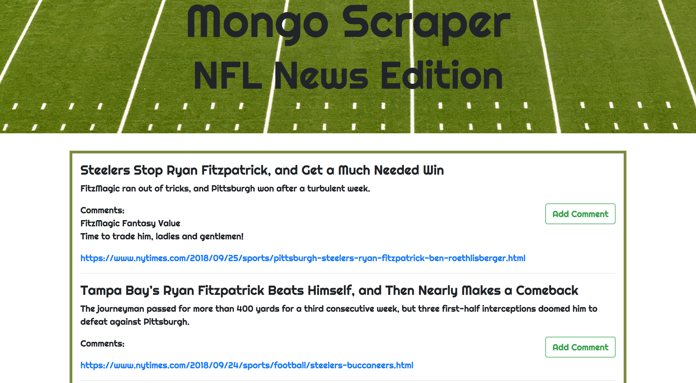

<h1>NFL News Scraper</h1>

<h2>What is it?</h2>
A web app utizilizing Cheerio to scrape the most recent NFL news from the New York Times Website. Articles are stored in a MongoDB via Mongoose. Users can run a new scrape or add comments on the articles displayed on the page.

<h2>Built With</h2>
<ul>
  <li>Express</li>
  <li>Handlebars</li>
  <li>CSS</li>
  <li>Bootstrap</li>
  <li>Google Fonts</li>
  <li>JavaScript</li>
  <li>jQuery</li>
  <li>Node.js</li>
  <li>Cheerio</li>
  <li>MongoDB</li>
  <li>Mongoose</li>
  <li>AJAX</li>
  <li>Request</li>
  <li>Body-Parser</li>
</ul>

<h2>How does it work?</h2>
When you arrive on the landing page, click "New Scrape" to scrape the most recent NFL headlines from the New York Times website. Then, you can scroll down to add comments about the articles or view comments left by other users.

<h2>Check it out on Heroku!</h2>
https://cryptic-dawn-33124.herokuapp.com/
